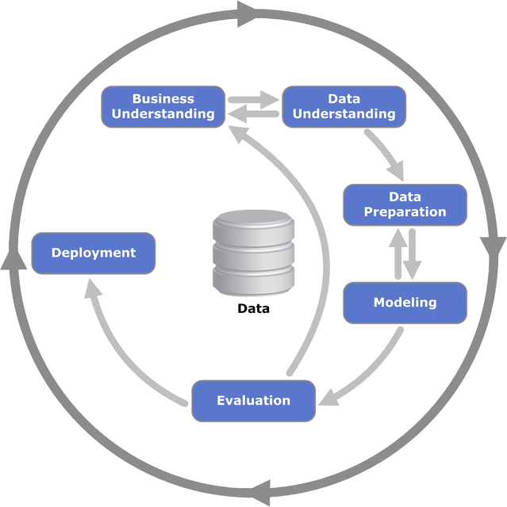

## Project Business Requirements
The cherry plantation crop from Farmy & Foods is facing a challenge where their cherry plantations have been presenting powdery mildew. Currently, the process is manual verification if a given cherry tree contains powdery mildew. An employee spends around 30 minutes in each tree, taking a few samples of tree leaves and verifying visually if the leaf tree is healthy or has powdery mildew. If there is powdery mildew, the employee applies a specific compound to kill the fungus. The time spent applying this compound is 1 minute.  The company has thousands of cherry trees, located on multiple farms across the country. As a result, this manual process is not scalable due to the time spent in the manual process inspection.

To save time in this process, the IT team suggested an ML system that detects instantly, using a leaf tree image, if it is healthy or has powdery mildew. A similar manual process is in place for other crops for detecting pests, and if this initiative is successful, there is a realistic chance to replicate this project for all other crops. The dataset is a collection of cherry leaf images provided by Farmy & Foods, taken from their crops.

* 1 - The client is interested in conducting a study to visually differentiate a healthy cherry leaf from one with powdery mildew.
* 2 - The client is interested in predicting if a cherry leaf is healthy or contains powdery mildew.

## Hypothesis
* Powdery mildew is a white, dusty coating that differentiates them from healthy leaves
### Validation
 * I will validate the hypothesis by collecting image dataset from the client and creating image montage for both hethy and powdery mildew affected leaves
 * I will test the hypothesis by average image analysis
 * I will also test the hypothesis by analysisg the difference between average images

## Setting up the work environment

I used Code Institute student template for Codeanywhere from [template](https://github.com/Code-Institute-Solutions/milestone-project-mildew-detection-in-cherry-leaves). However, I used VS Code instead of Codeanywhere. 

### Setting up local environment

1. I use this template to create my GitHub project repo 

2. Opened my VS Code and create a folder where I clone my github repo 
    <code>cd folder/to/clone-into/</code>
3. Clone the repo <code>git clone https://github.com/KhanRana/PP5-mildew-detection-in-cherry-leaves</code>

4. Create a new `venv` by <code>python -m venv venv </code> - the name of the virtual env is also `venv`.

5. The python version used is throughout is `python 3.9`

7. Open a new terminal and <code>pip install -r requirements.txt</code>

8. In the terminal type <code>pip install jupyter</code>

9. Install `ipykernel`, which provide `IPython` kernel for jupyter server to run in VS environment

10. Open the jupyter_notebooks directory in the jupyter webpage that has opened and click on the notebook you want to open.

11. Click the button Not Trusted and choose Trust.

Note that the kernel says Python 3. It inherits from the workspace so it will be Python-3.9.1 as installed. To confirm this you can use <code>! python --version</code> in a notebook code cell.

# Project Workflow
The project was carried out using CRISP-DM Process:
- Business understanding
- Data understanding
- Data Preparation
- Data Modelling
- Data Evaluation
- Deployment

*Source*: [CRISP-DM](https://en.wikipedia.org/wiki/Cross-industry_standard_process_for_data_mining) 

## Business understanding
### The rationale to map the business requirements to the Data Visualisations and ML tasks

- Business requirement 1  
As the client is interested in in differenciating a healthy leaf from a mildew contained, it make it a calssification problem. We have should have dataset of two classes: healthy; and powdery mildew". We will then check if the data is balanced: means both classes have similar label frequency. If the frequency is similar then the data is balanced, and we can proceed to the further analysis. The first of which would be to create an `Image Montage` to visually see the difference between the two using the known dataset. An `Image Montage` provides examples from each dataset. We also look at average image and variability image for both classes to see the pattens on both leaves. 

- Business requirement 2  
If the dataset is balnced than it would not need extensive cleaning and we can proceed to the answer the second requirement: predicting whether a new leaf is healthy of powdery mildew contained. We will provide the client with a dashboard. For the image prediction we will use `Convolution Neural Network` to train the ML model. The model can identify patterns, colors, and variation to classify the leaves. We will develop a dashboard that would have both features of showing image montage and a prediction feature. This will improve the client operations by minimising human efforts to identify affected plants. The client should be able to use the dashboard for any number of cherry leaves and provide healthy fruit to their clients.

In the following section we will look at the case for this study and see if it makes a ML business case.

### ML Business Case

In this section we will look at individual elements of the case and justify how it is a ML business case.

1. What are the business requirements? 
The client would like a tool to identify healthy cherry leaves from powdery mildew contained.
We understand that ML can be used to identify images and differentiate one from the other if a a model has been trained to an acceptable accuracy level.

2. Is there any business requirement that can be answered with conventional data analysis? 
The requirement 1 can be solved using traditional data analysis methods. However, the second requirement can not be solved using traditional data analysis approaches therefore we would need an ML tool to tackle the challenge.

3. Does the client need a dashboard or an API endpoint? 
The client needs a dashboard.

4. Can you break down the project into Epics and User Stories? 
The project can be broken down into epics and sotries. Please see [User Stories](documents/stories/user_stories.md)

5. Ethical or Privacy concerns? 
The client provided the data under an NDA (non-disclosure agreement), therefore the data should only be shared with professionals that are officially involved in the project. Please see [Dataset Content](#dataset-content)

6. What does the client consider as a successful project outcome? 
The client can visaully see and differentiate healthy leaves from powdery mildew contained ones.
Image montage can be created that shows both types of leaves 
 
The client will also be able to predict if a leaf is helthy or contains powdery mildew by uploading images to the dashboard.

7. What are the model's inputs and intended outputs? 
The input is a cherry leaf image and the output is a prediction of whether the cherry leaf is healthy or contains powdery mildew.

8. Does the data suggest a particular model?  
The data suggest it is a binary classification model.

9. What are the criteria for the performance goal of the predictions?  
An accuracy of 97% has been agreed with the client; however the model has been trained to a 99% accuracy.

10. How will the client benefit? 
The client will not supply the market with a compromised product.Furthermore, the client will also be able to scale up their operations in detecting mildew to other farms by minimising manual work.

### Data Understanding
* The dataset is sourced from [Kaggle](https://www.kaggle.com/codeinstitute/cherry-leaves). We then created a fictitious user story where predictive analytics can be applied in a real project in the workplace.
* The dataset contains +4 thousand images taken from the client's crop fields. The images show healthy cherry leaves and cherry leaves that have powdery mildew, a fungal disease that affects many plant species. The cherry plantation crop is one of the finest products in their portfolio, and the company is concerned about supplying the market with a compromised quality product.

### Data Preparation
Please refer to [Data Preparation](jupyter_notebooks/data_collection.ipynb) and [Data Visualisation](jupyter_notebooks/data_visualisation.ipynb) for details.

### Data Modelling
Please refer to [Data Modelling](jupyter_notebooks/data_modelling.ipynb) for details.

### Data Evaluation
Please refer to [Data Evaluation](jupyter_notebooks/data_modelling.ipynb) for details.

### Deployment
ML Dashboard has been developed and deployed to heroku.

#### Dashboard Design

## Unfixed Bugs
* You will need to mention unfixed bugs and why they were unfixed. This section should include shortcomings of the frameworks or technologies used. Although time can be a significant variable for consideration, paucity of time and difficulty understanding implementation is not a valid reason to leave bugs unfixed.

## Deployment
### Heroku

* The App live link is: https://YOUR_APP_NAME.herokuapp.com/ 
* Set the runtime.txt Python version to a [Heroku-20](https://devcenter.heroku.com/articles/python-support#supported-runtimes) stack currently supported version.
* The project was deployed to Heroku using the following steps.

1. Log in to Heroku and create an App
2. At the Deploy tab, select GitHub as the deployment method.
3. Select your repository name and click Search. Once it is found, click Connect.
4. Select the branch you want to deploy, then click Deploy Branch.
5. The deployment process should happen smoothly if all deployment files are fully functional. Click now the button Open App on the top of the page to access your App.
6. If the slug size is too large then add large files not required for the app to the .slugignore file. 

## Main Data Analysis and Machine Learning Libraries
* Here you should list the libraries used in the project and provide an example(s) of how you used these libraries.

## Credits 

* In this section, you need to reference where you got your content, media and from where you got extra help. It is common practice to use code from other repositories and tutorials. However, it is necessary to be very specific about these sources to avoid plagiarism. 
* You can break the credits section up into Content and Media, depending on what you have included in your project. 

### Content 

- The text for the Home page was taken from Wikipedia Article A.
- Instructions on how to implement form validation on the Sign-Up page were taken from [Specific YouTube Tutorial](https://www.youtube.com/).
- The icons in the footer were taken from [Font Awesome](https://fontawesome.com/).

### Media

- The photos used on the home and sign-up page are from This Open-Source site.
- The images used for the gallery page were taken from this other open-source site.

## Acknowledgements (optional)
* Thank the people that provided support throughout this project.
